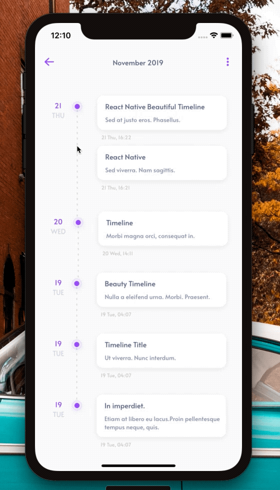
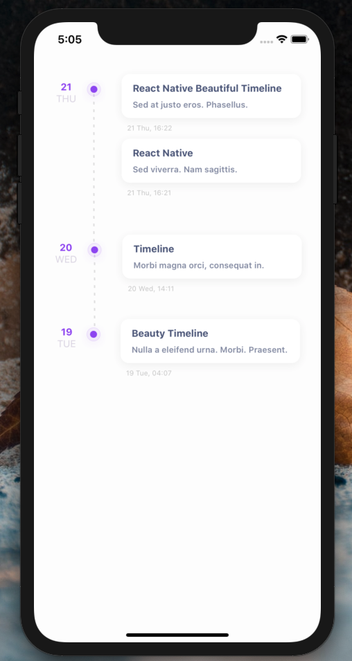

[](https://github.com/WrathChaos/react-native-beautiful-timeline)

[](https://github.com/WrathChaos/react-native-beautiful-timeline)

[](https://www.npmjs.com/package/react-native-beautiful-timeline)
[](https://www.npmjs.com/package/react-native-beautiful-timeline)

[](https://opensource.org/licenses/MIT)
[](https://github.com/prettier/prettier)

<p align="center">
  
  
</p>

# Installation

Add the dependency:

```ruby
npm i react-native-beautiful-timeline
```

## Peer Dependencies

###### IMPORTANT! You need install them

```js
"moment": ">= 2.24.0",
"react-native-dash-2": ">= 0.2.3",
"react-native-androw" : ">= 0.0.34",
"@freakycoder/react-native-helpers": ">= 0.1.0",
```

# Usage

## Import

```js
import Timeline from "react-native-beautiful-timeline";
```

## Basic Usage

### Data Format

The data format MUST like this example.

```json
[
  {
    "date": 1574342522000,
    "data": [
      {
        "title": "React Native Beautiful Timeline",
        "subtitle": "Sed at justo eros. Phasellus.",
        "date": 1574342522000
      },
      {
        "title": "React Native",
        "subtitle": "Sed viverra. Nam sagittis.",
        "date": 1574342501000
      }
    ]
  },
  {
    "date": 1574248261000,
    "data": [
      {
        "title": "Timeline",
        "subtitle": "Morbi magna orci, consequat in.",
        "date": 1574248261000
      }
    ]
  },
  {
    "date": 1574125621000,
    "data": [
      {
        "title": "Beauty Timeline",
        "subtitle": "Nulla a eleifend urna. Morbi. Praesent.",
        "date": 1574125621000
      }
    ]
  }
]
```

#### Let's take a look a bit closer:

For each day & there would be limitless objects(Cards) for each day something like this example:
Each card comes from `data` array and each **day** comes from each `object` from main array.

```json
{
  "date": 1574342522000,
  "data": [
    {
      "title": "React Native Beautiful Timeline",
      "subtitle": "Sed at justo eros. Phasellus.",
      "date": 1574342522000
    },
    {
      "title": "React Native",
      "subtitle": "Sed viverra. Nam sagittis.",
      "date": 1574342501000
    }
  ]
}
```

## Basic Usage

Please take a look at above data formatting. Library itself solves everything for you if the data format is correct.

```jsx
<Timeline data={data} />
```

## Configuration - Props

### Coming Soon !

## Future Plans

- [x] ~~LICENSE~~
- [x] ~~README: Better Example Image~~
- [x] ~~README: GIF Asset~~
- [x] ~~README: Data Formatting~~
- [x] ~~Configuration: Props~~
- [x] ~~Version 1~~
- [ ] Without Card Feature Data Formatting Implementation (Coming soon!)
- [ ] Write an article about the lib on Medium

## Credits

Thank you for this awesome inspiration. Designed by [Kamil Janus](https://dribbble.com/shots/3934981-Calendar-view-of-concept-financial-app)

## Author

FreakyCoder, kurayogun@gmail.com

## License

React Native Beautiful Timeline is available under the MIT license. See the LICENSE file for more info.
